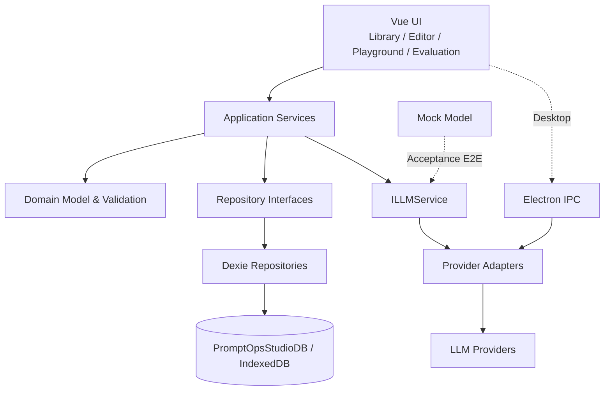
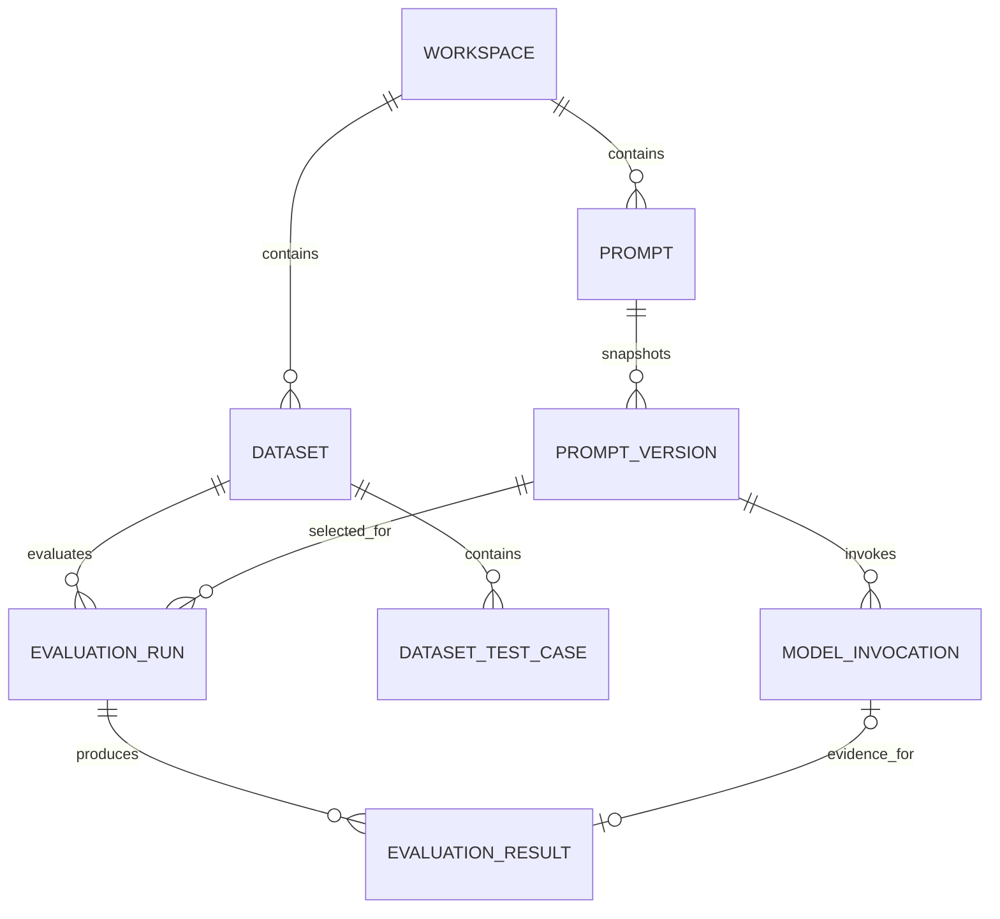

# PromptOps Studio

> 面向 AI 应用团队的 Prompt 生命周期管理与批量评测平台

PromptOps Studio 基于开源项目 [Prompt Optimizer](https://github.com/linshenkx/prompt-optimizer) 二次开发，将散落在文档、聊天记录和代码中的 Prompt，转化为可管理、可测试、可追踪的 AI 产品资产。当前版本是一个单用户、本地优先的 MVP，覆盖 Prompt 设计、不可变版本、模型调用、测试数据集、批量评测、失败诊断与重试追踪。

## 项目背景

随着 AI 应用从原型走向稳定交付，Prompt 不再只是单段文本。一个可维护的 Prompt 还包含动态变量、模型参数、输出约束、历史版本、测试样本、评测规则和运行证据。团队需要的不只是聊天界面，而是一条可复现的 Prompt 质量闭环。

## 用户痛点

- Prompt 分散在文档、聊天记录和代码中，难以复用和治理。
- 修改缺少版本依据，无法回答“哪个版本产生了这次结果”。
- 缺少固定 Dataset，版本间比较容易受输入变化干扰。
- 批量测试、失败隔离和规则诊断依赖人工操作。
- Token、成本、延迟和调用失败缺少统一观测。
- Retry 容易覆盖旧结果，质量决策缺少历史证据。
- 团队尚未形成统一的 Prompt 测试与发布流程。

## 产品定位

PromptOps Studio 不是简单的聊天界面，而是覆盖以下工作流的 PromptOps MVP：

```text
Prompt Design → Versioning → Model Invocation → Dataset Management
→ Batch Evaluation → Result Analysis → Retry and Traceability
```

目标用户包括 AI 产品经理、Prompt Engineer / AI 应用开发者，以及负责上线验收的测试和运营人员。

## 核心功能

| 模块 | 当前能力 |
| --- | --- |
| Prompt Library | 搜索、筛选、复制、归档、恢复和详情查看 |
| Prompt Editor | System/User Prompt、模型参数、输出配置和风险信息 |
| Dynamic Variables | `{{variable_name}}` 识别、同步、类型配置和输入校验 |
| Version History | V1.0 自动快照、另存新版本、详情查看和恢复为新版本 |
| Playground | 选择 Prompt/Version、填写变量、流式调用和输出校验 |
| Invocation Observability | 状态、原始输出、延迟、TTFT、Token、成本和错误脱敏 |
| Dataset Management | Test Case CRUD、筛选、批量操作、安全 JSON 导入导出 |
| Batch Evaluation | 不可变版本、Case 选择、有限并发、进度和失败隔离 |
| Deterministic Evaluators | Contains、Not Contains、Exact Match、JSON、Expected JSON、JSON Field Exists，以及 JSON Schema 子集 |
| Reliability | Cancel pending、Retry Entire/Failed/Case、刷新中断恢复和历史追踪 |
| Metrics | Invocation Success Rate、Validation Pass Rate、Latency、Token、Cost 和 Score |
| Quality | 英/简中/繁中，多条 Mock Playwright E2E，不消耗真实模型额度 |

## 产品流程


## 技术架构

主要技术栈：Vue、TypeScript、IndexedDB、Dexie、Electron IPC、Playwright。业务采用 Domain Model、Repository Pattern 和 Application Service 分层；模型能力统一通过 `ILLMService` 与 Provider Adapter 接入。



## 数据模型



- `PromptVersion` 是 Prompt 内容、变量和配置的不可变快照。
- `EvaluationRun` 保存评测配置快照；Retry 始终创建新 Run，不覆盖来源 Run。
- `EvaluationResult` 保存 Test Case 与规则的运行时快照，保证历史结果可解释。
- `ModelInvocation` 保存渲染后 Prompt、原始输出、状态和可用指标。
- 数据库不保存 API Key、Authorization Header、Provider Secret、内部堆栈或 Vue Proxy。

## 3–5 分钟 Demo

推荐使用内置 `Customer Complaint Response` Prompt 和 Mock 模型演示：创建/修改版本 → 创建 Dataset → 批量评测 → 查看成功、规则失败、skipped 和 unavailable → 打开 Invocation Detail → Retry 并验证新 Run。

完整逐秒脚本与稳定数据见 [Demo 视频脚本](docs/product/demo-script.md)，Demo 验收清单见 [Demo 操作手册](docs/product/demo-playbook.md)。

## Demo 截图

截图统一存放于 [`docs/images/`](docs/images/README.md)。当前仓库预留以下正式演示图位，录制前应使用无密钥、无个人信息的 Mock 数据更新：

| 页面 | 文件 |
| --- | --- |
| Dashboard | `docs/images/dashboard.png` |
| Prompt Library | `docs/images/prompt-library.png` |
| Prompt Editor | `docs/images/prompt-editor.png` |
| Version History | `docs/images/version-history.png` |
| Playground | `docs/images/playground.png` |
| Invocation Detail | `docs/images/invocation-detail.png` |
| Dataset Detail | `docs/images/dataset-detail.png` |
| Evaluation Configuration | `docs/images/evaluation-configuration.png` |
| Evaluation Run Detail | `docs/images/evaluation-run-detail.png` |
| Failed Case Diagnosis | `docs/images/failed-case-drawer.png` |

## 本地启动

要求：Node.js `^22.0.0`，pnpm `10.6.1`。

```powershell
cd D:\VCproject\prompt-optimizer
C:\nvm4w\nodejs\corepack.cmd pnpm dev
```

打开 `http://localhost:18181/#/dashboard`。Windows PATH 排查与开发说明见 [docs/DEVELOPMENT.md](docs/DEVELOPMENT.md)。

常用验证命令：

```powershell
pnpm typecheck:core
pnpm typecheck:ui
pnpm typecheck:web
pnpm build:web
pnpm test:e2e:promptops
pnpm test:e2e:promptops-invocation
pnpm test:e2e:promptops-datasets
pnpm test:e2e:promptops-phase4
pnpm test:e2e:promptops-phase4-acceptance
```

Phase 3/4 E2E 使用 Mock 模型，不会调用真实付费 API。

## 当前限制

- 当前是单用户 IndexedDB MVP，不支持跨设备共享与多人协作。
- 浏览器端 API Key 不适合公开生产部署；公开环境应使用服务端 Secret 管理。
- Pricing 是本地静态配置，不会自动同步供应商价格。
- Electron IPC 和部分 Provider 尚未统一支持真正取消运行中请求。
- JSON Schema 只实现了明确子集，并非完整标准。
- 页面刷新会中断正在运行的 Evaluation；系统会将中断任务收敛为可追踪状态，但不会在后台继续执行。
- 尚未实现完整权限、审批、正式发布门禁和服务端审计。

## Roadmap

- A/B Prompt Experiment 与多版本对比
- LLM-as-a-Judge 和人工评审
- Multi-model Comparison
- Approval Workflow 与 Release Gate
- Server-side Workspace、Shared Dataset 与 RBAC
- Production Secret Management
- Provider Pricing Synchronization

## 产品与求职材料

- [一页产品介绍](docs/product/product-overview.md)
- [用户画像](docs/product/user-persona.md)
- [MVP 范围](docs/product/mvp-scope.md)
- [产品架构](docs/product/product-architecture.md)
- [评测指标体系](docs/product/evaluation-metrics.md)
- [竞品分析](docs/product/competitive-analysis.md)
- [Phase 1–4 迭代记录](docs/product/iteration-history.md)
- [项目复盘](docs/product/project-retrospective.md)
- [中英文简历描述](docs/product/resume-descriptions.md)

## 开源来源与许可证

本项目基于 linshenkx 的开源项目 [Prompt Optimizer](https://github.com/linshenkx/prompt-optimizer) 二次开发。原项目名称、版权声明和提交历史均予以保留；PromptOps Studio 的主要新增内容包括 Prompt 生命周期管理、不可变版本、调用记录、Dataset、批量评测与结果追踪。

代码按 [GNU Affero General Public License v3.0](LICENSE) 发布。AGPL 是强 copyleft 开源许可证：分发修改版本，或通过网络向用户提供修改后的程序功能时，需要按许可证向相应用户提供完整对应源代码及许可证声明。请勿将本项目描述为“全部原创”或闭源的 “source available” 软件；具体义务以许可证原文为准。
