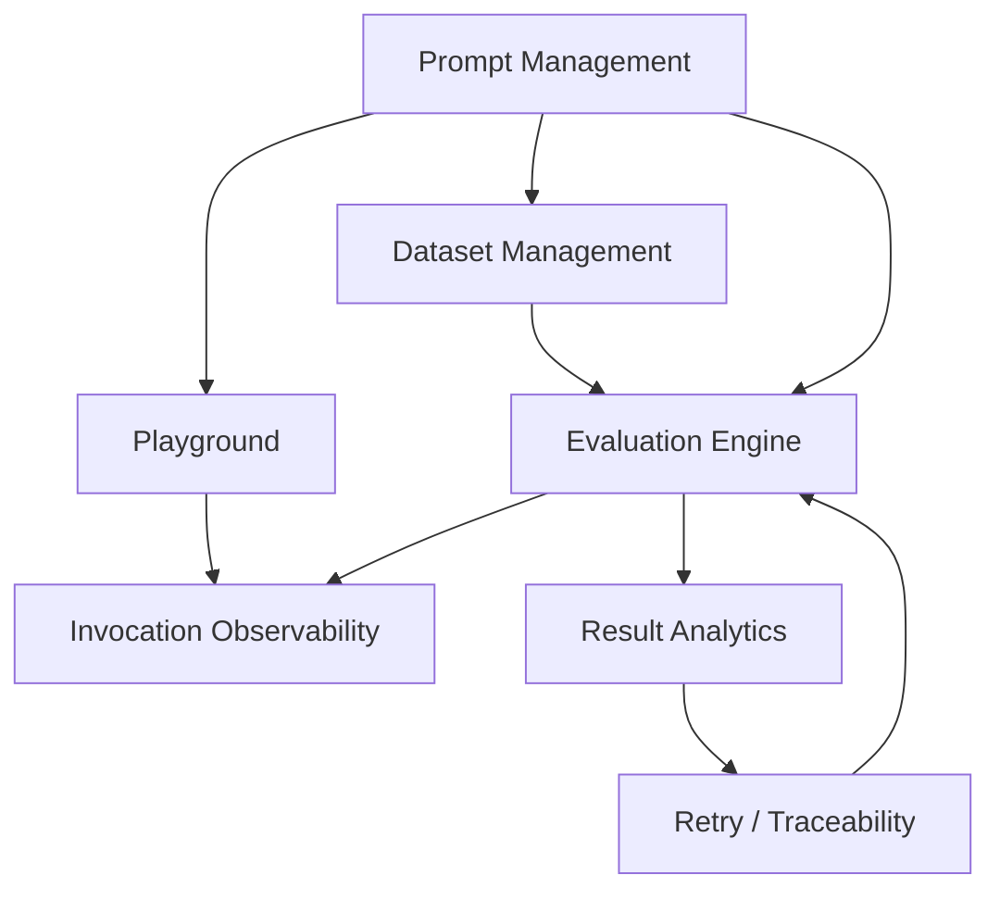
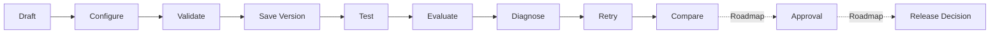

# 产品架构与生命周期

## 产品模块

- Prompt Management：管理模板、变量、配置和不可变版本。
- Playground：对选定版本进行单次调试和输出校验。
- Invocation Observability：记录渲染输入、原始输出、状态、Token、成本和延迟。
- Dataset Management：沉淀输入、预期与确定性规则。
- Evaluation Engine：有限并发运行 Case，隔离输入错误、Provider 错误和规则失败。
- Result Analytics：聚合调用成功率、规则通过率、性能和成本。
- Retry / Traceability：从失败结果创建新 Run，保留来源 Run。

## Prompt 生命周期

当前的 Compare 是通过多个历史 Run 和指标进行人工比较，并非完整 A/B 产品能力；Approval 与正式 Release Decision 尚未实现。

## 技术分层与数据流

Vue 页面调用 Application Service；服务编排领域校验、Repository 与 `ILLMService`。Dexie Repository 将可序列化快照写入 IndexedDB；Provider Adapter 屏蔽模型供应商差异。Electron 环境通过 IPC 传递可序列化请求参数。Mock Model 复用相同服务路径，为 E2E 提供确定性输出。

关键边界：UI 不直接拼接持久化记录；请求级参数不写回模型配置；输入校验失败不伪造 Invocation；Retry 不修改历史 Run/Result。

